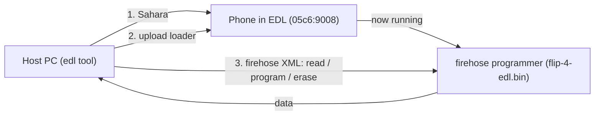

# tcl-flip-4-root

**Experimental, no-wipe root for the TCL Flip 4 (T440W) over Qualcomm EDL** -
make the phone fully SELinux-permissive and get an `adb root` (`uid=0`) shell,
without unlocking the bootloader or wiping userdata.

> ## Read this first - this is experimental and dangerous
>
> - This is **unofficial, experimental** reverse-engineering work that succeeded
>   on **one specific phone**. Nothing here is guaranteed to be safe on yours.
> - Writing to flash over EDL **can and may well PERMANENTLY BRICK your phone.**
>   There is no warranty and no undo button.
> - **Do your own research.** Understand each step before you run it. If a command
>   doesn't make sense to you, stop.
> - **ALWAYS MAKE A FULL, VERIFIED BACKUP BEFORE DOING ANYTHING** with
>   `scripts/backup.sh`. Every image we flash is carved from that backup and is
>   reversible - as long as the backup exists.
>
> You accept all risk. See [LICENSE](LICENSE): provided "as is", without warranty.

Two ways to read this:

- **New here, or you just want to run the commands?** -> [Part 1: Just root it](#part-1-just-root-it).
- **Want to understand how it works or adapt it?** -> [Part 2: How it works](#part-2-how-it-works-technical).

---

# Part 1: Just root it

For beginners and anyone who mostly wants to follow steps. Take it slow, and
**do not skip the backup.**

## What you get

- **Full root over ADB** (`adb root` gives you a `uid=0` shell).
- **SELinux fully permissive**, so root can actually do things (needed for the
  KaiOS Firefox remote debugger, privileged app dev, etc.).
- **No bootloader unlock and no data wipe** - your phone's contents stay intact,
  and Android Verified Boot stays on.

## Is this even your phone?

This only applies to the **TCL Flip 4 / "Go Flip 5G", model T440W** (also called
`gflip5gtmo` / `pitti_32go`). If your phone is a different model, **none of this
applies** and following it may brick it. Check with `adb shell getprop ro.product.model`.

## Honest expectations

There is **no one-click root script.** The safe/easy part - installing the tools
and making a backup - is scripted. The rooting itself is a careful, manual,
multi-step procedure (it needs some Linux-side tools) and is written out
step-by-step in **[docs/ROOT.md](docs/ROOT.md)**. Read that whole doc before you
start.

## Steps

1. **Install the tools** (needs Python 3 and a data-capable USB cable; no drivers
   on macOS):

   ```bash
   scripts/setup.sh
   ```

2. **Put the phone into EDL mode** (Qualcomm's low-level `05c6:9008` mode). If USB
   debugging is on, the easiest is:

   ```bash
   adb reboot edl
   ```

   Other ways (key combo, test point) are in
   [Entering EDL mode](#entering-edl-mode).

3. **Confirm the phone is detected:**

   ```bash
   scripts/check-device.sh
   ```

4. **MAKE YOUR BACKUP. Do not skip this.** It dumps and verifies a full,
   restorable image of the whole phone (~29 GiB, ~15 min):

   ```bash
   scripts/backup.sh
   ```

   Copy `backups/flip4-full-emmc.img` somewhere safe before going further.

5. **Follow the root runbook:** **[docs/ROOT.md](docs/ROOT.md)**. It walks through
   building the patched images and flashing them. Go carefully and verify each
   read-back before you reboot.

If anything looks wrong, **stop and do not reboot** - see
[Troubleshooting](#troubleshooting) and the rollback section of
[docs/ROOT.md](docs/ROOT.md).

---

# Part 2: How it works (technical)

For people who want to understand the mechanism or port it. This is denser; the
full, exact procedure with offsets lives in [docs/ROOT.md](docs/ROOT.md).

## What was achieved (on one unit)

- Fully permissive SELinux (all 2991 policy types), observed on hardware:
  `adb shell dmesg` works and the loaded policy reports `2991/2991` permissive.
- **`adb root` returns `uid=0(root)`**, by making the build report
  `ro.debuggable=1` (added to `/odm/etc/build.prop`, which overrides the `system`
  value at init property-load time - no `system`/`vbmeta_system` edit).
- Method: in **one** `odm` rebuild, edit `/odm/etc/selinux/precompiled_sepolicy`
  **and** `/odm/etc/build.prop`, regenerate dm-verity, **surgically re-sign
  `vbmeta_b`** with the AOSP test key, and flash the active slot over EDL (one
  pass). No bootloader unlock, no userdata wipe, AVB still enforced.

This worked on this specific device. It is not a promise it will work - or be
safe - on another unit.

## Why it's possible: AVB uses the public AOSP test key

`vbmeta` (and the chained `boot`/`recovery` descriptors) are signed with
`SHA256_RSA4096`, and the public key **matches the AOSP `testkey_rsa4096`** whose
private half is public. Because the verified-boot root of trust is a key we hold,
we can re-sign modified images and the **locked** bootloader still accepts them -
no unlock, no wipe, verification stays on. Full detail:
[docs/ROOT.md](docs/ROOT.md).

## The device

| Property | Value |
|---|---|
| Phone | TCL Flip 4 / "Go Flip 5G", model **T440W** (`gflip5gtmo` / `pitti_32go`) |
| OS | **KaiOS 4 on Android 14** base, `user`/test-keys, SDK 34, kernel `6.1.90-android14` |
| SoC | Qualcomm (HWID `0x002980e100420071`, MSM_ID `0x002980e1`) |
| EDL USB id | `05c6:9008` |
| Storage | eMMC, 512-byte sectors, ~29.12 GiB (61,079,552 sectors) |
| Layout | GPT, **A/B slots** (`_a`/`_b`), **Virtual A/B (VABC)**, `super`, `userdata`; active slot **B** |
| AVB | signed with the public **AOSP `testkey_rsa4096`** (so re-signable) |
| Loader | `loader/flip-4-edl.bin` (firehose programmer, required) |

## How EDL / firehose works

Qualcomm SoCs have a low-level recovery mode, **EDL** (USB `05c6:9008`). In EDL
the chip speaks **Sahara**, whose only job is to accept a signed **firehose
programmer** (a small ELF that runs on the phone). Once uploaded, you speak
**firehose** (XML-over-USB) to read/write flash.



Two things are always required: the **loader** (`loader/flip-4-edl.bin`,
provided) and a host tool that speaks Sahara + firehose - the vendored, patched
`edl` in `vendor/edlclient/`.

## The one rule: reads vs writes

This loader needs different handling per direction. The scripts already do the
right thing; if you call `edl` by hand:

- **READ / dump** (`r`, `rs`, `printgpt`, backups): pass `--skipresponse`.
- **WRITE** (`w`, `ws`, ...): do **NOT** pass `--skipresponse`, or the write
  reports success but silently does not commit.

Why, in detail: [docs/PATCHES.md](docs/PATCHES.md).

## Setup

Requires Python 3 and a data-capable USB cable. On macOS there are **no drivers
to install** - libusb (via `pyusb`) talks to the device directly.

```bash
scripts/setup.sh
```

This creates `.venv/`, installs `requirements.txt`, and verifies the vendored
`edl` loads. The tool is vendored and already patched (see
[docs/PATCHES.md](docs/PATCHES.md)); recreating `.venv` never loses the fixes.

**Linux only:** install the udev rules, then replug the phone:

```bash
sudo cp linux/51-edl.rules linux/50-android.rules /etc/udev/rules.d/
sudo udevadm control --reload-rules && sudo udevadm trigger
```

## Entering EDL mode

The phone must enumerate as USB **`05c6:9008`**. Easiest first:

1. **ADB** (if USB debugging is on): `adb reboot edl`
2. **Fastboot** (if reachable): `fastboot oem edl`
3. **Key combo:** power off fully, hold both volume keys while plugging in USB.
4. **Test point:** short the labeled EDL test point to ground while connecting
   USB (last resort).

Then confirm (on macOS, `system_profiler` often won't list 9008, so this asks
libusb directly):

```bash
scripts/check-device.sh
```

## Full backup (do this before anything else)

With the phone in EDL mode:

```bash
scripts/check-device.sh          # should detect the 9008 device
scripts/backup.sh                # dumps + verifies backups/flip4-full-emmc.img
```

The full image is ~29 GiB (~15 min at ~35 MB/s) and is verified afterward
(primary + backup GPT present, size 512-aligned). When done, **pull the battery
for ~10s and power on** to leave EDL. For everything else (restore, per-partition,
erase, raw sectors, slots, memory), see [docs/CAPABILITIES.md](docs/CAPABILITIES.md).

## Troubleshooting

- **Hangs at "Trying to read first storage sector..."** - a read is missing
  `--skipresponse`.
- **A write "succeeded" but didn't stick** - you used `--skipresponse` on a
  write; rerun without it and read back to verify.
- **`check-device.sh` says NOT FOUND** - not in EDL, charge-only cable, or behind
  a hub. Re-enter EDL and use a direct port.
- **Everything hangs after you killed a command** - killing `edl` mid-transfer
  leaves the loader stale (`Sahara error`). Pull the battery ~10s, re-enter EDL.
  One clean command per session is safest.
- **`reset` doesn't reboot** - known for this loader; pull the battery and power
  on.

## Docs map

- **[docs/ROOT.md](docs/ROOT.md)** - the full EDL-only runbook for permissive
  SELinux + `adb root` (exact offsets, rollback).
- **[docs/CAPABILITIES.md](docs/CAPABILITIES.md)** - every firehose command the
  loader exposes (backup, restore, erase, slots, raw sector I/O, memory).
- **[docs/PATCHES.md](docs/PATCHES.md)** - what was fixed in the vendored `edl`,
  and the one operational rule that matters (`--skipresponse`: reads yes, writes
  no).

## Credits and license

- Inspired by and built on Ryjelsum's writeup,
  [*Continuing my Qualcomm garbage addiction: QM215 KaiOS flip phones*](https://ryjelsum.me/homelab/qm215-kaios-flips/).
  The `loader/flip-4-edl.bin` firehose programmer (the T440W loader extracted
  from TCL vendor tooling) came from that work, and their notes on the
  `TypeError: a bytes-like object` firehose bug pointed the way; the remaining
  fixes here are revisions this specific phone needed (see
  [docs/PATCHES.md](docs/PATCHES.md)).
- EDL tool: [bkerler/edl](https://github.com/bkerler/edl) (c) B. Kerler, GPLv3 -
  vendored, patched, and slimmed in `vendor/edlclient/` (see its `LICENSE`).
- `loader/flip-4-edl.bin`: proprietary Qualcomm/TCL signed firehose programmer,
  redistributed for interoperability/backup.
- See [NOTICE](NOTICE) for full attributions. Because the vendored `edl` is
  GPLv3, redistributing that directory must comply with the GPLv3.
