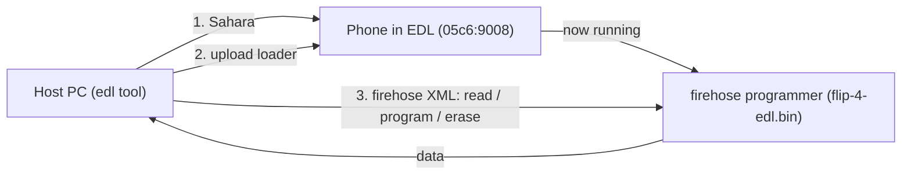

# tcl-flip-4-root

**EDL-only root (SELinux-permissive) for the TCL Flip 4** - plus the firehose
reference and backup toolkit it is built on.

This repo documents and tools a **no-wipe, no-unlock** way to make the TCL Flip 4
fully SELinux-permissive over Qualcomm **EDL firehose**, with Android Verified
Boot left **on**. It works because the device's AVB root of trust is the public
AOSP test key, so modified images can be re-signed and the locked bootloader
still accepts them.

- **Want root / permissive?** -> **[docs/ROOT.md](docs/ROOT.md)** (the runbook).
- **Just want a backup?** -> [Quickstart](#quickstart-full-backup).

> WRITE/erase over EDL can brick the phone. Make a verified full backup first
> (`scripts/backup.sh`); every patched image we flash is carved from it and
> reversible.

## What was achieved

- Fully permissive SELinux (all 2991 policy types), verified on hardware:
  `adb shell dmesg` works and the loaded policy reports `2991/2991` permissive.
- Method: edit `/odm/etc/selinux/precompiled_sepolicy`, regenerate dm-verity,
  **surgically re-sign `vbmeta_b`** with the AOSP test key, flash the active
  slot over EDL. No bootloader unlock, no userdata wipe, AVB still enforced.
- Full details, exact offsets, and rollback: **[docs/ROOT.md](docs/ROOT.md)**.

## Docs map

- **[docs/ROOT.md](docs/ROOT.md)** - the EDL-only permissive-root runbook.
- **[docs/CAPABILITIES.md](docs/CAPABILITIES.md)** - every firehose command the
  loader exposes (backup, restore, erase, slots, raw sector I/O, memory).
- **[docs/PATCHES.md](docs/PATCHES.md)** - what was fixed in the vendored `edl`,
  and the one operational rule that matters (`--skipresponse`: reads yes, writes
  no).

## The device

| Property | Value |
|---|---|
| Phone | TCL Flip 4 / "Go Flip 5G", model **T440W** (`gflip5gtmo` / `pitti_32go`) |
| OS | **KaiOS 4 on Android 14** base, `user`/test-keys, SDK 34, kernel `6.1.90-android14` |
| SoC | Qualcomm (HWID `0x002980e100420071`, MSM_ID `0x002980e1`) |
| EDL USB id | `05c6:9008` |
| Storage | eMMC, 512-byte sectors, ~29.12 GiB (61,079,552 sectors) |
| Layout | GPT, **A/B slots** (`_a`/`_b`), **Virtual A/B (VABC)**, `super`, `userdata`; active slot **B** |
| AVB | signed with the public **AOSP `testkey_rsa4096`** (so re-signable) |
| Loader | `loader/flip-4-edl.bin` (firehose programmer, required) |

## How EDL / firehose works

Qualcomm SoCs have a low-level recovery mode, **EDL** (USB `05c6:9008`). In EDL
the chip speaks **Sahara**, whose only job is to accept a signed **firehose
programmer** (a small ELF that runs on the phone). Once uploaded, you speak
**firehose** (XML-over-USB) to read/write flash.



So two things are always required: the **loader** (`loader/flip-4-edl.bin`,
provided) and a host tool that speaks Sahara + firehose (the vendored, patched
`edl` in `third_party/`).

## Setup (one time)

Requires Python 3 and a data-capable USB cable. On macOS there are **no drivers
to install** - libusb (via `pyusb`) talks to the device directly.

```bash
scripts/setup.sh
```

This creates `.venv/`, installs `requirements.txt`, and verifies the vendored
`edl` loads. The tool is vendored and already patched (see
[docs/PATCHES.md](docs/PATCHES.md)); recreating `.venv` never loses the fixes.

**Linux only:** install the udev rules, then replug the phone:

```bash
sudo cp linux/51-edl.rules linux/50-android.rules /etc/udev/rules.d/
sudo udevadm control --reload-rules && sudo udevadm trigger
```

## Entering EDL mode

The phone must enumerate as USB **`05c6:9008`**. Easiest first:

1. **ADB** (if USB debugging is on): `adb reboot edl`
2. **Fastboot** (if reachable): `fastboot oem edl`
3. **Key combo:** power off fully, hold both volume keys while plugging in USB.
4. **Test point:** short the labeled EDL test point to ground while connecting
   USB (last resort).

Then confirm (on macOS, `system_profiler` often won't list 9008, so this asks
libusb directly):

```bash
scripts/check-device.sh
```

## The one rule: reads vs writes

This loader needs different handling per direction. The scripts already do the
right thing; if you call `edl` by hand:

- **READ / dump** (`r`, `rs`, `printgpt`, backups): pass `--skipresponse`.
- **WRITE** (`w`, `ws`, ...): do **NOT** pass `--skipresponse`, or the write
  reports success but silently does not commit.

Why: [docs/PATCHES.md](docs/PATCHES.md).

## Quickstart: full backup

With the phone in EDL mode:

```bash
scripts/check-device.sh          # should detect the 9008 device
scripts/backup.sh                # dumps + verifies backups/flip4-full-emmc.img
```

The full image is ~29 GiB (~15 min at ~35 MB/s) and is verified afterward
(primary + backup GPT present, size 512-aligned). When done, **pull the battery
for ~10s and power on** to leave EDL. For everything else (restore,
per-partition, erase, raw sectors, slots, memory), see
[docs/CAPABILITIES.md](docs/CAPABILITIES.md).

## Troubleshooting

- **Hangs at "Trying to read first storage sector..."** - a read is missing
  `--skipresponse`.
- **A write "succeeded" but didn't stick** - you used `--skipresponse` on a
  write; rerun without it and read back to verify.
- **`check-device.sh` says NOT FOUND** - not in EDL, charge-only cable, or
  behind a hub. Re-enter EDL and use a direct port.
- **Everything hangs after you killed a command** - killing `edl` mid-transfer
  leaves the loader stale (`Sahara error`). Pull the battery ~10s, re-enter EDL.
  One clean command per session is safest.
- **`reset` doesn't reboot** - known for this loader; pull the battery and power
  on.

## Credits and license

- Inspired by and built on Ryjelsum's writeup,
  [*Continuing my Qualcomm garbage addiction: QM215 KaiOS flip phones*](https://ryjelsum.me/homelab/qm215-kaios-flips/).
  The `loader/flip-4-edl.bin` firehose programmer (the T440W loader extracted
  from TCL vendor tooling) came from that work, and their notes on the
  `TypeError: a bytes-like object` firehose bug pointed the way; the remaining
  fixes here are revisions this specific phone needed (see
  [docs/PATCHES.md](docs/PATCHES.md)).
- EDL tool: [bkerler/edl](https://github.com/bkerler/edl) (c) B. Kerler, GPLv3 -
  vendored and patched in `third_party/edlclient/` (see its `LICENSE`).
- `loader/flip-4-edl.bin`: proprietary Qualcomm/TCL signed firehose programmer,
  redistributed for interoperability/backup.
- See [NOTICE](NOTICE) for full attributions. Because the vendored `edl` is
  GPLv3, redistributing that directory must comply with the GPLv3.
