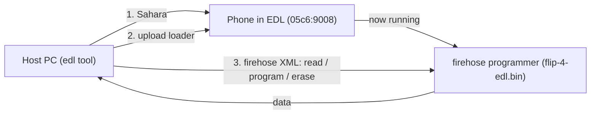

# tcl-flip-4-root

**EDL Firehose reference and toolkit for the TCL Flip 4** (Qualcomm QM215, KaiOS
feature phone).

This repo gives you a working, self-contained way to talk to the phone's
Qualcomm **EDL (Emergency Download) firehose** loader from macOS or Linux, and
documents every capability that loader exposes: back up, restore/flash, erase,
read the partition table, raw sector I/O, low-level memory access, device info,
and reboot.

If you just want a backup, jump to [Quickstart](#quickstart-full-backup).

---

## Contents

- [How EDL / firehose works](#how-edl--firehose-works)
- [The device](#the-device)
- [What the loader can do](#what-the-loader-can-do)
- [Repo layout](#repo-layout)
- [Setup (one time)](#setup-one-time)
- [Entering EDL mode](#entering-edl-mode)
- [Quickstart: full backup](#quickstart-full-backup)
- [Troubleshooting](#troubleshooting)
- [How the tool was patched](#how-the-tool-was-patched)
- [Credits and license](#credits-and-license)

---

## How EDL / firehose works

Qualcomm SoCs have a low-level recovery mode called **EDL** (Emergency Download,
USB `05c6:9008`). In EDL the chip speaks a small protocol called **Sahara**,
whose only real job is to accept a signed **firehose programmer** (a little ELF
that runs on the phone). Once that programmer is uploaded, you speak
**firehose** (an XML-over-USB protocol) to read/write the phone's flash.



So two things are always required: the **loader** (`loader/flip-4-edl.bin`,
provided here) and a host tool that speaks Sahara + firehose (the vendored,
patched `edl` in this repo).

## The device

| Property | Value |
|---|---|
| Phone | TCL Flip 4 |
| SoC | Qualcomm QM215 |
| EDL USB id | `05c6:9008` |
| Storage | eMMC, 512-byte sectors |
| Capacity | ~29.12 GiB (61,079,552 sectors) |
| Layout | GPT, **A/B slots** (`_a` / `_b` partitions), `super`, `userdata` |
| HWID (observed) | `0x002980e100420071` |
| Loader build date | May 14 2025 |

## What the loader can do

On connect, the loader advertises **23 firehose functions** (`program`, `read`,
`erase`, `patch`, `configure`, `getstorageinfo`, `setbootablestoragedrive`,
`power`, `firmwarewrite`, `peek`/`poke` via patch, secure-boot status, etc.).

These map to concrete commands - the full, example-by-example reference is in
**[docs/CAPABILITIES.md](docs/CAPABILITIES.md)**. Quick index:

| Capability | Safety | Command |
|---|---|---|
| Device / secure-boot info | READ | `secureboot`, connect header |
| Storage info | READ | `getstorageinfo` |
| Partition table | READ | `printgpt`, `gpt <dir>` |
| Full backup | READ | `rf <file>` |
| Per-partition / single / raw read | READ | `rl <dir>`, `r <name> <file>`, `rs <start> <count> <file>` |
| A/B slot | READ/CONTROL | `getactiveslot`, `setactiveslot` |
| Flash / restore | WRITE | `w`, `wl`, `wf`, `ws` |
| Erase | WRITE | `e`, `es` |
| Reboot / power | CONTROL | `reset` |
| Low-level memory / fuses | ADVANCED | `peek`, `poke`, `pbl`, `qfp`, `memtbl` |

> WRITE and erase commands can brick the phone. Always make a verified backup
> first (`scripts/backup.sh`).

## Repo layout

```
.
├── README.md                 # this file
├── docs/
│   ├── CAPABILITIES.md       # every firehose capability, with examples
│   └── PATCHES.md            # what was fixed in the vendored edl, and why
├── loader/
│   └── flip-4-edl.bin        # the firehose programmer for this phone (required)
├── scripts/
│   ├── setup.sh              # create .venv + install deps
│   ├── check-device.sh       # is the phone visible in EDL mode?
│   ├── backup.sh             # full backup + verify
│   └── edl                   # wrapper around the vendored edl tool
├── third_party/
│   └── edlclient/            # vendored + patched bkerler/edl (GPLv3)
├── linux/                    # udev rules for Linux hosts
├── requirements.txt          # runtime deps for the vendored edl
├── backups/                  # dumps land here (gitignored)
└── NOTICE / LICENSE
```

## Setup (one time)

Requires Python 3 and a data-capable USB cable. On macOS there are **no drivers
to install** - libusb (via `pyusb`) talks to the device directly.

```bash
scripts/setup.sh
```

This creates `.venv/`, installs `requirements.txt`, and verifies the vendored
`edl` tool loads. (The `edl` tool itself is vendored in `third_party/` and
already patched - see [docs/PATCHES.md](docs/PATCHES.md).)

**Linux only:** install the udev rules so you can access the device without root,
then replug the phone:

```bash
sudo cp linux/51-edl.rules linux/50-android.rules /etc/udev/rules.d/
sudo udevadm control --reload-rules && sudo udevadm trigger
```

## Entering EDL mode

The phone must enumerate as USB **`05c6:9008`**. Ways to get there, easiest
first:

1. **ADB** (if USB debugging is on): `adb reboot edl`
2. **Fastboot** (if you can reach the bootloader): `fastboot oem edl`
3. **Key combo:** power off fully, then hold both volume keys while plugging in
   USB.
4. **Test point:** open the phone and short the labeled EDL test point to ground
   while connecting USB (last resort).

Then confirm:

```bash
scripts/check-device.sh
```

> On macOS, `system_profiler` often will **not** list the 9008 device even when
> it's connected - that's why `check-device.sh` asks libusb directly.

> Every read/dump command on this device needs `--skipresponse`. The scripts
> already include it; if you call `edl` by hand, don't forget it. See
> [docs/PATCHES.md](docs/PATCHES.md) for why.

## Quickstart: full backup

With the phone in EDL mode:

```bash
scripts/check-device.sh          # should say the 9008 device is detected
scripts/backup.sh                # dumps + verifies backups/flip4-full-emmc.img
```

The full image is ~29 GiB and takes ~15 minutes at ~35 MB/s. `backup.sh`
verifies it afterward (primary + backup GPT present, size 512-aligned).

When you're done, **pull the battery for ~10s and power on** to leave EDL mode.

For anything beyond a full backup (restore, per-partition, erase, raw sectors,
slots, memory peek/poke), see **[docs/CAPABILITIES.md](docs/CAPABILITIES.md)**.

## Troubleshooting

- **Hangs at "Trying to read first storage sector..."** - you forgot
  `--skipresponse`. The scripts include it; add it to any manual `edl` command.
- **`check-device.sh` says NOT FOUND** - the phone isn't in EDL mode, or the
  cable is charge-only, or it's behind a hub. Re-enter EDL and use a direct port.
- **macOS shows nothing in System Information** - expected; trust
  `check-device.sh` instead.
- **A command hung and you killed it; now everything hangs** - killing `edl`
  mid-transfer leaves the loader in a stale state. Pull the battery for ~10s,
  re-enter EDL, and try again (one clean command per session is safest).
- **`reset` doesn't reboot the phone** - known for this loader; just pull the
  battery and power on.

## How the tool was patched

Stock `edl` 3.62 hangs/crashes on this loader. This repo vendors it with three
fixes (a `TypeError` on the read ACK, an infinite USB-retry loop, and unbounded
empty-read loops), plus the mandatory `--skipresponse` workaround. Details:
**[docs/PATCHES.md](docs/PATCHES.md)**.

The fixes live in `third_party/edlclient/` so they survive; recreating `.venv`
does **not** lose them (only runtime deps come from `requirements.txt`).

## Credits and license

- EDL tool: [bkerler/edl](https://github.com/bkerler/edl) (c) B. Kerler, GPLv3 -
  vendored and patched in `third_party/edlclient/` (see its `LICENSE`).
- `loader/flip-4-edl.bin`: proprietary Qualcomm/TCL signed firehose programmer,
  redistributed for interoperability/backup.
- See [NOTICE](NOTICE) for full attributions. Because the vendored `edl` is
  GPLv3, redistributing that directory must comply with the GPLv3.
