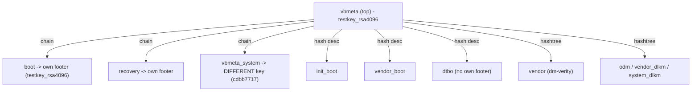

# Rooting the TCL Flip 4 (KaiOS 4) over EDL

An **EDL-only, no-wipe** path to a **fully SELinux-permissive** TCL Flip 4,
adapting the old KaiOS 2.5 boot-patch idea to the phone's real KaiOS 4
(Android 14) internals.

> Status: **DONE and verified on hardware.** The device boots `green` on its
> normal (active) slot with every SELinux type permissive (`2991/2991`), no
> bootloader unlock, no userdata wipe, AVB still on.

> WRITE operations can brick the phone. A full verified backup
> (`scripts/backup.sh` -> `backups/flip4-full-emmc.img`) is a prerequisite; we
> carve every image we need out of that backup, offline, and keep per-partition
> `backups/pre-flash/` dumps so any write is reversible.

## Why the old writeup does not apply

The BananaHackers KaiOS 2.5 method edits `default.prop`/`init.rc` and swaps
`sbin/adbd` inside a simple boot ramdisk. On this device none of that exists in
any ramdisk:

- KaiOS 4 runs on an **Android 14 base** (`user`/test-keys, SDK 34, kernel
  `6.1.90-android14`).
- Layout is **GKI A/B**: `boot` = kernel only (no ramdisk), `init_boot` = stock
  first-stage `init`, `vendor_boot` = kernel modules + `fstab` + bootconfig.
- `adbd`, `ro.debuggable`, init `.rc`, and the SELinux policy all live in the
  **`super`** dynamic partitions (`system`, `vendor`, `odm`, ...), protected by
  **AVB (dm-verity)**.

So the modern equivalent is: modify content in a verity-protected partition,
regenerate its verity data, **re-sign AVB**, and flash over EDL.

## The device (this unit)

Canonical device facts are in the [README](../README.md#the-device). The
root-critical specifics used below:

- Active slot **B**; partitioning is **Virtual A/B (VABC)** (snapshots +
  compression), so patched dynamic partitions go to the **active** slot base
  (see "Two facts" below), not an "inactive" slot.
- `odm` footer fingerprint (needed for `avbtool` props):
  `TCL/gflip5gtmo/pitti_32go:14/UKQ1.241125.001/jenkins12220921:user/test-keys`.

## The key finding: AVB uses the public AOSP test key

`vbmeta` (and the `boot`/`recovery` chained descriptors) are signed with
**`SHA256_RSA4096`**, and the public key **matches AOSP `testkey_rsa4096`**:

```
device vbmeta_b key sha256 : 7728e30f50bfa5cea165f473175a08803f6a8346642b5aa10913e9d9e6defef6
AOSP testkey_rsa4096       : 7728e30f50bfa5cea165f473175a08803f6a8346642b5aa10913e9d9e6defef6   (MATCH)
```

Because the AVB root of trust is a **public** key we hold the private half of, we
can re-sign modified images and the **locked** bootloader still accepts them - no
unlock, no wipe, and verification can stay ON. This is what makes EDL-only root
possible on this phone.

### AVB chain map



The `odm` hashtree descriptor lives in the **top `vbmeta`** (our key), so editing
`odm` only requires re-signing `vbmeta` - not `vbmeta_system`.

NOT ours: `vbmeta_system` (`system`/`system_ext`/`product`) - do not modify.

## Two facts that shaped the working approach

1. **Virtual A/B, but the base is authoritative.** The device is VABC with
   snapshots, yet on the live system `snapuserd` is **not running**, `/odm` is
   mounted from `odm-verity` over the base extent, and the live
   `/odm/etc/selinux/precompiled_sepolicy` is **byte-identical** to the `odm_b`
   base carved from `super`. The OTA merge is complete and reads are linear from
   the base, so we modify the **active slot's** `odm` base in place (not the
   "inactive" slot - slot A's dynamic space is cannibalized under VABC).

   Confirm before trusting this on another unit (device booted, `adb`):
   ```bash
   adb shell 'getprop ro.boot.slot_suffix; ls -l /dev/block/mapper/ | grep odm'
   adb shell 'toybox ps -A -o NAME | grep -i snapuserd || echo "snapuserd NOT running"'
   adb shell 'grep " /odm " /proc/mounts'
   adb shell 'sha256sum /odm/etc/selinux/precompiled_sepolicy'   # must equal odm_b base
   ```

2. **The target is `odm`, not `vendor`.** The precompiled policy actually loaded
   at boot is `/odm/etc/selinux/precompiled_sepolicy` (1,260,564 B stock). `odm`
   is tiny (1,470,464 B partition) which keeps the rebuild fast.

## Tooling

Fetched into `tools/` (see `NOTICE`):

- `tools/avb/avbtool.py` - AOSP Android Verified Boot tool (re-sign / info).
- `tools/avb/testkeys/testkey_rsa4096.pem` - AOSP test key (private half).
- `tools/setpermissive.c` - tiny `libsepol` tool: load a binary policy, mark
  **every type** permissive (via `permissive_map`), write it back. Build on
  Linux: `cc -O2 -o setpermissive tools/setpermissive.c -l:libsepol.a`.

Repo helpers:

- `scripts/extract-partition.py` - carve any GPT partition out of the full
  backup, offline. `--list` to see everything.
- `scripts/lp_extract.py` - minimal `liblp` reader: list/extract logical
  partitions from `super`, and (via its extent print) the physical offset of a
  logical partition inside `super`.
- `scripts/patch_vbmeta.py` - **surgically** change one hashtree descriptor's
  root digest in a signed `vbmeta`, zero its FEC fields, and re-sign - leaving
  every other descriptor byte-identical.

> Linux-only steps (`debugfs`, `libsepol`, `avbtool` FEC) were run in a Linux
> container; the EDL flashing runs on the host.

## Phase 1 - Recon + AVB gate

```bash
scripts/edl printgpt --loader=loader/flip-4-edl.bin --memory=emmc --skipresponse

# Carve what we need from the full backup (offline)
scripts/extract-partition.py backups/flip4-full-emmc.img vbmeta_b build/vbmeta_b.img
scripts/extract-partition.py backups/flip4-full-emmc.img super    build/super.img
scripts/lp_extract.py --slot=1 build/super.img odm_b build/odm_b.img   # active slot = B = liblp slot 1

# The gate: vbmeta signed with the AOSP test key?
tools/avb/avbtool.py info_image --image build/vbmeta_b.img
tools/avb/avbtool.py extract_public_key --key tools/avb/testkeys/testkey_rsa4096.pem --output /tmp/tk
# sha256(/tmp/tk) must equal the device vbmeta key blob -> MATCH
```

## Phase 2 - Build the permissive `odm` + re-signed `vbmeta_b`

All offline; nothing touches the phone.

```bash
# 1. Pull the precompiled policy out of the odm_b base and make ALL types permissive
debugfs -R "dump /etc/selinux/precompiled_sepolicy /work/pp" build/odm_b.img
./setpermissive /work/pp /work/pp.permissive          # -> "made 2991 types permissive"

# 2. Write it back into a copy of the odm ext4, fix owner/mode/selinux xattr, fsck
cp build/odm_b.img build/odm_b-ext4.img
debugfs -w -R "rm /etc/selinux/precompiled_sepolicy" build/odm_b-ext4.img
debugfs -w -R "write /work/pp.permissive /etc/selinux/precompiled_sepolicy" build/odm_b-ext4.img
debugfs -w -R "sif /etc/selinux/precompiled_sepolicy mode 0100644" build/odm_b-ext4.img
debugfs -w -R "sif /etc/selinux/precompiled_sepolicy uid 0" build/odm_b-ext4.img
debugfs -w -R "sif /etc/selinux/precompiled_sepolicy gid 0" build/odm_b-ext4.img
debugfs -w -R "ea_set -f ctx.bin /etc/selinux/precompiled_sepolicy security.selinux" build/odm_b-ext4.img
e2fsck -fy build/odm_b-ext4.img

# 3. Truncate to the raw fs size and regenerate the verity footer to the EXACT
#    stock geometry (salt/block/partition_size from `info_image build/odm_b.img`).
#    FEC is dropped (no `fec` binary needed); dm-verity boots fine without it.
head -c 1363968 build/odm_b-ext4.img > build/odm_b-patched.img
tools/avb/avbtool.py add_hashtree_footer --image build/odm_b-patched.img \
  --partition_name odm --partition_size 1470464 --hash_algorithm sha256 \
  --block_size 4096 --do_not_generate_fec \
  --salt 5ff3ad795b534f56467f3d40354fee9798d15819f7f9a0f71cbbbe1b4b5459d5 \
  --prop com.android.build.odm.os_version:14 \
  --prop "com.android.build.odm.fingerprint:TCL/gflip5gtmo/pitti_32go:14/UKQ1.241125.001/jenkins12220921:user/test-keys"
# note the new Root Digest from:
tools/avb/avbtool.py info_image --image build/odm_b-patched.img

# 4. Surgically update ONLY the odm descriptor in vbmeta_b and re-sign.
#    (Full make_vbmeta_image can't reproduce dtbo, which has no own AVB footer.)
scripts/patch_vbmeta.py build/vbmeta_b.img odm <NEW_ROOT_DIGEST> \
  tools/avb/testkeys/testkey_rsa4096.pem build/vbmeta_b-patched.img --zero-fec

# 5. Prove it: signature verifies, and ONLY the odm digest + FEC changed vs stock
tools/avb/avbtool.py verify_image --image build/vbmeta_b-patched.img \
  --key tools/avb/testkeys/testkey_rsa4096.pem          # "Successfully verified ... vbmeta struct"
diff <(tools/avb/avbtool.py info_image --image build/vbmeta_b.img) \
     <(tools/avb/avbtool.py info_image --image build/vbmeta_b-patched.img)
```

## Phase 3 - Flash the ACTIVE slot over EDL

`odm_b` lives inside `super`; `vbmeta_b` is its own GPT partition. Absolute eMMC
sectors on this unit (confirm on yours with `extract-partition.py --list` and the
`lp_extract.py` extent print):

| Target | Absolute sector | Sectors | Bytes |
|---|---|---|---|
| `vbmeta_b` | `3377152` | 128 | 65,536 |
| `odm_b` (super start `3686400` + extent `2048`) | `3688448` | 2872 | 1,470,464 |

> **CRITICAL - EDL write handshake:** this loader only commits a `program` when
> the XML handshake response is read. Do WRITES **without** `--skipresponse`
> (reads still need it). A write done *with* `--skipresponse` reports success but
> **silently does not persist** and desyncs the loader. Always read back and
> compare sha256 before rebooting.

```bash
# Fresh EDL each session (key-combo while plugging USB -> clean 0x9008 / Sahara).

# Pre-flash dumps (reversibility) + prove offsets are stock before writing:
scripts/edl r  vbmeta_b backups/pre-flash/vbmeta_b.img --loader=loader/flip-4-edl.bin --memory=emmc --skipresponse
scripts/edl rs 3688448 2872 backups/pre-flash/odm_b.img --loader=loader/flip-4-edl.bin --memory=emmc --skipresponse
shasum -a256 backups/pre-flash/*.img build/vbmeta_b.img build/odm_b.img   # device == stock

# WRITE (note: NO --skipresponse), then READ BACK (WITH --skipresponse) and compare
scripts/edl ws 3377152 build/vbmeta_b-patched.img --loader=loader/flip-4-edl.bin --memory=emmc
scripts/edl ws 3688448 build/odm_b-patched.img    --loader=loader/flip-4-edl.bin --memory=emmc
scripts/edl rs 3377152 128  /tmp/vb.img  --loader=loader/flip-4-edl.bin --memory=emmc --skipresponse
scripts/edl rs 3688448 2872 /tmp/odm.img --loader=loader/flip-4-edl.bin --memory=emmc --skipresponse
shasum -a256 /tmp/vb.img build/vbmeta_b-patched.img /tmp/odm.img build/odm_b-patched.img   # must match
```

Then battery-pull and boot **normally** (no key-combo).

## Phase 4 - Verify on device

```bash
adb shell getenforce                               # prints "Enforcing" (global mode)...
adb pull /sys/fs/selinux/policy build/live_policy   # ...but the loaded policy is permissive:
# count permissive types (libsepol) -> total_types=2991 permissive_types=2991
adb shell 'dmesg | head'                            # WORKS = shell domain is permissive
adb shell 'sha256sum /odm/etc/selinux/precompiled_sepolicy'   # == permissive build, not stock
```

`getenforce` still says `Enforcing` because that is the *global* mode flag; with
every **type** permissive, no domain enforces (denials are logged only). The
practical proof is that a normally SELinux-denied shell action (`dmesg`) now
succeeds. This is what the KaiOS Firefox remote debugger / privileged app-dev
work needs.

## Rollback

Re-enter EDL and restore the pre-flash dumps (writes WITHOUT `--skipresponse`):

```bash
scripts/edl ws 3377152 backups/pre-flash/vbmeta_b.img --loader=loader/flip-4-edl.bin --memory=emmc
scripts/edl ws 3688448 backups/pre-flash/odm_b.img    --loader=loader/flip-4-edl.bin --memory=emmc
```

`backups/flip4-full-emmc.img` is the ultimate fallback. EDL writes work even on
the locked bootloader (AVB is enforced at boot, not at firehose level), so
recovery is always available.

## Out of scope / do not touch

- `vbmeta_system`, `system`, `system_ext`, `product` - chained to a key we do
  **not** hold; modifying them fails verification.
- Bootloader unlock / `fastboot` - locked on this unit, and unlocking would wipe
  userdata (the whole point of this path is to avoid that).
